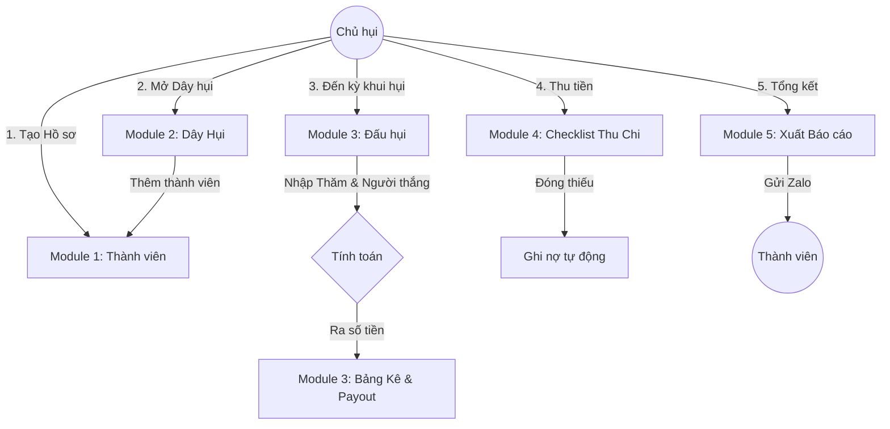

# Đặc tả Hệ thống Quản lý Hụi Thông minh (SmartHui)

## 1. Tổng quan
SmartHui là ứng dụng desktop quản lý hụi chuyên nghiệp, tập trung vào tính chính xác tài chính, minh bạch trong quy trình đấu hụi và quản lý công nợ chặt chẽ.

## 2. Các Module Chức năng Chính

### Module 1: Quản lý Danh sách Thành viên (Member Management)
Là "danh bạ" trung tâm lưu trữ hồ sơ người chơi.
*   **Chức năng:**
    *   **Thêm/Sửa/Xóa:** Lưu `Tên`, `SĐT` (ID định danh), `Zalo`, `Địa chỉ` và `Ghi chú`.
    *   **Hồ sơ tín dụng:** 
        *   Tự động tính tổng số dây đang chơi, số chân đã hốt, tổng nợ hiện tại.
        *   Gán nhãn: `Uy tín`, `Bình thường`, `Cần chú ý` (Blacklist).
*   **UI/UX:**
    *   Dạng danh sách (Table View) với ô tìm kiếm nhanh theo Tên/SĐT.
    *   Highlight màu đỏ cho thành viên thuộc nhóm "Cần chú ý".

### Module 2: Thiết lập Dây Hụi (Cycle Setup)
Nơi khởi tạo và cấu hình "luật chơi" cho các nhóm hụi.
*   **Chức năng:**
    *   **Khai báo thông số:**
        *   `Tên dây` (VD: Dây 5tr/tháng - Bà Ba).
        *   `Loại hình`: Ngày, Tuần, 15 Ngày, Tháng, Mùa.
        *   `Vốn` (Amount Per Share).
        *   `Tiền thảo` (Commission): Nhập % hoặc số tiền cố định.
    *   **Phân chân hụi (Slotting):** 
        *   Chọn thành viên từ danh sách vào dây.
        *   Hỗ trợ một thành viên giữ nhiều chân (VD: Chân 1, Chân 5).
    *   **Nhập liệu lịch sử:** Cho phép nhập `Kỳ hiện tại` và đánh dấu các chân đã hốt để tiếp tục quản lý các dây cũ.
*   **UI/UX:**
    *   Form tạo dây hụi đơn giản, flow từng bước (Wizard).
    *   Bảng phân chân hỗ trợ kéo thả hoặc chọn nhanh từ danh sách thành viên.

### Module 3: Thực hiện Kỳ Đấu (Bidding & Calculation)
Trái tim của hệ thống - nơi tính toán tiền long.
*   **Chức năng:**
    *   **Nhập kết quả đấu:** Chọn `Người thắng` và nhập `Giá thăm/thầu` (Bid Amount).
    *   **Tính toán Payout (Tiền hốt):**
        *   Công thức: `Thực nhận = (Sống * (Vốn - Thăm)) + (Chết * Vốn) - Thảo - Nợ cũ`.
        *   Tự động truy thu nợ đọng của người thắng từ các kỳ trước hoặc dây khác.
    *   **Lập bảng kê đóng tiền (Contribution Plan):**
        *   Danh sách chi tiết ai phải đóng bao nhiêu.
        *   Phân biệt rõ: Tiền hụi sống (đã trừ thăm) và Hụi chết (đóng đủ).
*   **UI/UX:**
    *   Màn hình nhập liệu nổi bật, hạn chế sai sót.
    *   Hiển thị tức thì kết quả tính toán trước khi bấm Lưu.

### Module 4: Theo dõi Thu chi & Đối soát (Tracking)
Thay thế sổ tay ghi chép hàng ngày.
*   **Chức năng:**
    *   **Checklist thu tiền:** Danh sách các thành viên cần đóng trong kỳ.
    *   **Trạng thái đóng:**
        *   `Đủ`: Đánh dấu đã thu.
        *   `Thiếu`: Nhập số thực thu -> Máy tự tính nợ còn lại (Arrears).
    *   **Nhắc nợ tự động:** Tạo mẫu tin nhắn Zalo kèm số tiền chi tiết để gửi nhắc thành viên.
*   **UI/UX:**
    *   Giao diện dạng Checklist tiến độ (Progress Bar).
    *   Nút copy tin nhắn nhanh bên cạnh tên mỗi thành viên.

### Module 5: Báo cáo & Xuất bản (Reporting)
Minh bạch hóa dữ liệu cho cả chủ hụi và thành viên.
*   **Chức năng:**
    *   **Phiếu tính hụi (Sớ hụi):** Xuất ảnh/PDF chi tiết kết quả kỳ đấu để gửi Group Zalo.
    *   **Sổ nợ cá nhân:** Sao kê lịch sử đóng/hốt của từng thành viên để đối chiếu.
    *   **Báo cáo chủ hụi:** Tổng hợp tiền thảo (lợi nhuận) và tổng nợ xấu cần thu hồi.
*   **UI/UX:**
    *   Xem trước (Preview) báo cáo.
    *   Nút "Xuất ảnh" và "Xuất Excel".

---

## 3. Quy trình Nghiệp vụ (Workflow Diagram)

---

## 4. Yêu cầu Phi chức năng & Kỹ thuật

*   **Database:** SQLite (File `smarthui.db`) - Dễ dàng backup/restore bằng cách copy file.
*   **Kiến trúc:** Mô hình MVC (Model-View-Controller) tách biệt giao diện và logic tính toán.
*   **Độ chính xác:** Sử dụng kiểu dữ liệu `Decimal` cho mọi tính toán tiền tệ.
*   **Bảo mật:** Tự động sao lưu dữ liệu mỗi khi tắt ứng dụng.
*   **Nền tảng:** Python 3.10+ & PyQt6.

---

## 5. Ma trận Truy xuất (Traceability Matrix)

| Module | Tính năng | File Code Chính | Trạng thái |
| :--- | :--- | :--- | :--- |
| **1. Member** | DS Thành viên, Uy tín | `ui/members_tab.py` | Đã có khung |
| **2. Setup** | Tạo dây, Phân chân | `ui/hui_list_tab.py` | Cần làm thêm phần Wizard |
| **3. Bidding** | Tính tiền, Trừ nợ | `services/finance_service.py` | Đã có logic lõi |
| **4. Tracking** | Checklist thu/chi | `ui/hui_list_tab.py` | Chưa có |
| **5. Report** | Xuất ảnh/PDF | `ui/reports_tab.py` | Chưa có |

Chào bạn, để đáp ứng yêu cầu "càng dài càng tốt" và mang tính chuyên nghiệp thực thụ, tôi đã soạn thảo bản đặc tả chi tiết cho **Module Quản lý Dây Hụi (Cycle Management)**.

Bản spec này không chỉ dừng lại ở các ô nhập liệu mà còn đi sâu vào logic nghiệp vụ, quản lý trạng thái (State Machine) và các quy tắc ràng buộc dữ liệu để bạn có thể dùng làm "đề bài" cực chuẩn cho Gemini trong AI Studio gen code.

---

# ĐẶC TẢ CHI TIẾT: MODULE QUẢN LÝ DÂY HỤI (CYCLE MANAGEMENT)

## 1. MỤC TIÊU VÀ PHẠM VI

Module này đóng vai trò là "Xương sống" của toàn bộ hệ thống. Nó chịu trách nhiệm định nghĩa cấu trúc tài chính, quản lý vòng đời của các dây vốn và lưu vết toàn bộ các thiết lập cốt lõi trước khi các giao dịch diễn ra.

---

## 2. CẤU TRÚC DỮ LIỆU CHI TIẾT (DATA SCHEMA)

Hệ thống phải lưu trữ các thuộc tính sau cho mỗi dây hụi (Table: `HuiCycles`):

| Thuộc tính | Kiểu dữ liệu | Mô tả & Ràng buộc |
| --- | --- | --- |
| `Cycle_ID` | String (UUID) | Mã định danh duy nhất toàn cầu. |
| `Title` | String | Tên gợi nhớ (Ví dụ: "Hụi mua xe tháng 10"). |
| `Base_Amount` | Decimal | **Số tiền vốn** mỗi chân hụi (Vd: 5.000.000). |
| `Commission_Type` | Enum | `FIXED_AMOUNT` (Tiền tươi) hoặc `PERCENTAGE` (%). |
| `Commission_Value` | Decimal | Giá trị tiền thảo trả cho chủ hụi mỗi kỳ. |
| `Frequency` | Enum | Tần suất: `DAILY`, `WEEKLY`, `BI_WEEKLY`, `MONTHLY`. |
| `Total_Periods` | Integer | Tổng số kỳ (thường bằng tổng số chân hụi). |
| `Start_Date` | Date | Ngày mở bát (Kỳ 1). |
| `Bidding_Rule` | Enum | `OPEN_BID` (Đấu công khai) hoặc `SEALED_BID` (Bỏ thăm kín). |
| `Min_Bid_Step` | Decimal | Bước nhảy tối thiểu khi bỏ thăm (Vd: 10.000). |
| `Max_Bid_Limit` | Decimal | Giới hạn bỏ thăm tối đa (Tránh việc bỏ thăm quá cao gây bể hụi). |
| `Status` | Enum | Trạng thái: `DRAFT`, `ACTIVE`, `PAUSED`, `CLOSED`. |

---

## 3. QUẢN LÝ THÀNH VIÊN TRONG DÂY (SLOT MANAGEMENT)

Trong mô hình doanh nghiệp, chúng ta không quản lý "Người", chúng ta quản lý **"Chân hụi" (Slot)**. Một người có thể sở hữu nhiều chân.

### 3.1. Danh sách chân hụi (Table: `CycleSlots`)

* **Slot_Index:** Số thứ tự chân hụi (1, 2, 3...).
* **Member_ID:** Liên kết với bảng Thành viên.
* **Status:** `LIVE` (Chưa hốt), `DEAD` (Đã hốt), `ABANDONED` (Vỡ nợ/Bỏ cuộc).
* **Is_Joint:** Boolean (Đánh dấu nếu chân hụi này có nhiều người góp chung).

### 3.2. Chân hụi đồng sở hữu (Joint Ownership)

* Hệ thống cho phép chia một Slot cho N người theo tỷ lệ phần trăm (Vd: Người A 50%, Người B 50%).
* Logic tính toán sẽ tự động chia nhỏ nghĩa vụ đóng tiền và quyền lợi hốt tiền dựa trên tỷ lệ này.

---

## 4. QUY TRÌNH VÒNG ĐỜI (LIFECYCLE & STATE MACHINE)

Dây hụi phải trải qua các trạng thái nghiêm ngặt để đảm bảo tính toàn vẹn dữ liệu:

1. **Trạng thái DRAFT (Nháp):**
* Chủ hụi đang thiết lập thông số, thêm/bớt thành viên.
* Ở trạng thái này, mọi thông số đều có thể sửa đổi.

2. **Trạng thái ACTIVE (Đang chạy):**
* Sau khi nhấn "Bắt đầu dây", các thông số `Base_Amount`, `Total_Periods` sẽ bị **KHOÁ** (Read-only) để bảo vệ tính nhất quán tài chính.
* Hệ thống bắt đầu tạo các phiên đấu (`BiddingSessions`) tự động theo lịch.

3. **Trạng thái PAUSED (Tạm dừng):**
* Dùng khi có sự cố tranh chấp. Mọi hoạt động bỏ thăm bị đình chỉ.

4. **Trạng thái CLOSED (Kết thúc):**
* Dây hụi hoàn thành khi kỳ cuối cùng đã được thanh toán xong.
* Dữ liệu được chuyển vào kho lưu trữ lịch sử để báo cáo ROI.

---

## 5. LOGIC CHUYỂN ĐỔI DÂY ĐANG CHẠY (MIGRATION LOGIC)

Đây là tính năng quan trọng khi người dùng bắt đầu dùng app nhưng đã có dây hụi chạy ngoài đời được vài kỳ.

* **Input yêu cầu:**
* Số kỳ đã thực hiện ().
* Danh sách  người đã thắng kỳ trước.
* Giá thăm thắng của từng kỳ đó.

* **Hành động hệ thống:**
* Tự động đánh dấu  chân hụi tương ứng thành `DEAD`.
* Tạo  bản ghi lịch sử trong bảng giao dịch.
* Tính toán số dư nợ (Debt) hiện tại của các thành viên này để đưa vào báo cáo tổng hợp.

---

## 6. QUY TẮC RÀNG BUỘC (BUSINESS RULES)

Để module này hoạt động chuyên nghiệp, cần áp dụng các Constraints (Ràng buộc) sau:

* **Ràng buộc số chân:** `Total_Periods` phải bằng đúng số lượng `Slot` đã đăng ký.
* **Ràng buộc duy nhất:** Trong một kỳ (`Period`), chỉ được phép có duy nhất 1 người thắng (Trừ trường hợp hụi đôi, hụi ba nhưng phải được cấu hình trước).
* **Ràng buộc hốt hụi:** Thành viên đã ở trạng thái `DEAD` không được phép tham gia bỏ thăm ở các kỳ tiếp theo của dây đó.
* **Ràng buộc tiền thảo:** Tiền thảo không được phép vượt quá một tỷ lệ phần trăm nhất định (Vd: 20%) giá trị phần hụi để tránh vi phạm pháp luật về lãi suất.

---

